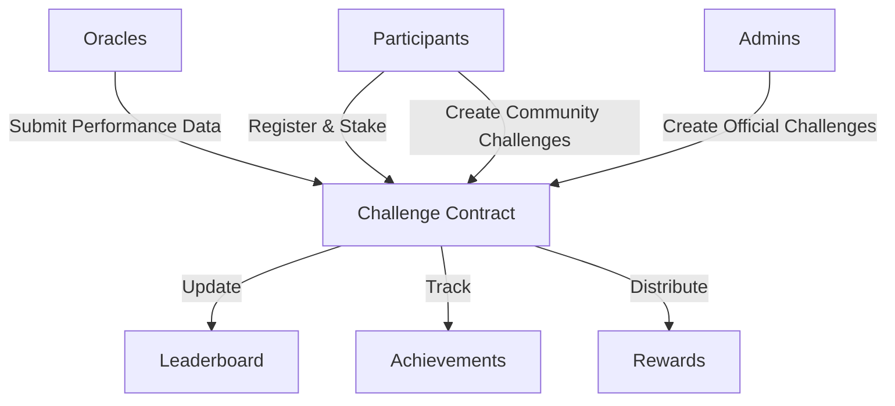

# Yield Virtual Machine

A blockchain-powered platform for competitive challenges and performance-based reward distribution across multiple domains.

## Overview

Yield Virtual Machine enables participants to engage in multi-dimensional performance challenges on the blockchain. The platform features:

- Creation and participation in virtual performance challenges
- Verifiable achievement tracking through trusted oracles
- Automated reward distribution based on performance metrics
- Real-time dynamic leaderboards
- Both official and community-created challenges
- Stake-to-participate mechanism

## Architecture

The Yield Virtual Machine system is built around a core smart contract that handles:



### Core Components:
- Challenge Management
- Participant Registration
- Performance Data Verification
- Achievement Tracking
- Reward Distribution
- Dynamic Leaderboard System

## Contract Documentation

### Yield Machine Contract (`yield-machine.clar`)

The core contract managing the entire Yield Virtual Machine ecosystem.

#### Key Features:
- Role-based access control (Admin, Oracle)
- Challenge creation and management
- Participant registration and tracking
- Performance data submission and verification
- Achievement tracking
- Automated reward distribution
- Dynamic leaderboard updates

#### Access Control
- Contract Owner: Full administrative control
- Admins: Can create official challenges and manage platform
- Oracles: Authorized to submit verified performance data
- Users: Can participate in challenges and create community challenges

## Getting Started

### Prerequisites
- Clarinet
- Stacks wallet
- STX tokens for participation

### Basic Usage

1. **Creating a Challenge**
```clarity
(contract-call? .yield-machine create-challenge
    "30-Day Performance Sprint"
    "Achieve progressive performance milestones"
    false  ;; community challenge
    u1234567890  ;; start time
    u1237246290  ;; end time
    u300000  ;; performance goal
    u200000  ;; advanced goal
    u100000000  ;; entry fee in microSTX
    u100  ;; max participants
    u0)  ;; initial reward pool
```

2. **Registering for a Challenge**
```clarity
(contract-call? .yield-machine register-for-challenge u1)
```

3. **Submitting Performance Data (Oracle)**
```clarity
(contract-call? .yield-machine submit-performance-data 
    u1  ;; challenge-id
    tx-sender  ;; participant
    u5000  ;; performance metric
    u4000)  ;; advanced metric
```

4. **Claiming Rewards**
```clarity
(contract-call? .yield-machine claim-rewards u1)
```

## Function Reference

### Administrative Functions
- `set-contract-owner`: Update contract owner
- `grant-role`: Assign roles to addresses
- `revoke-role`: Remove roles from addresses

### Challenge Management
- `create-challenge`: Create new performance challenge
- `end-challenge`: Conclude an active challenge
- `add-to-reward-pool`: Add funds to challenge rewards

### Participant Functions
- `register-for-challenge`: Join a challenge
- `claim-rewards`: Collect earned rewards

### Oracle Functions
- `submit-performance-data`: Submit verified performance metrics

### Read-Only Functions
- `get-challenge`: Retrieve challenge details
- `get-participant-data`: Get participant statistics
- `get-leaderboard`: View challenge rankings
- `get-achievements`: Check participant achievements
- `get-estimated-reward`: Calculate potential rewards

## Development

### Testing
```bash
# Run contract tests
clarinet test

# Check contract deployment
clarinet console
```

### Local Development
1. Clone the repository
2. Install Clarinet
3. Deploy contracts locally:
```bash
clarinet deploy --local
```

## Security Considerations

### Known Limitations
- Relies on trusted oracles for performance data
- Leaderboard limited to top 50 participants
- Challenge duration constraints (1-30 days)

### Best Practices
- Verify challenge parameters before participation
- Wait for transaction confirmation before UI updates
- Monitor oracle submissions for anomalies
- Review reward calculations before claiming

### Risk Mitigation
- Performance data must increase monotonically
- Rewards locked until challenge completion
- Role-based access control for critical functions
- Challenge parameters validated at creation